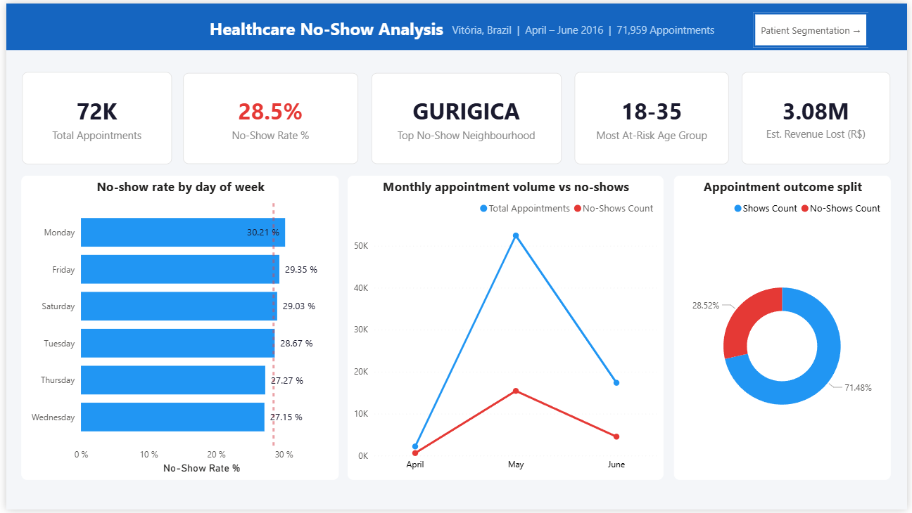
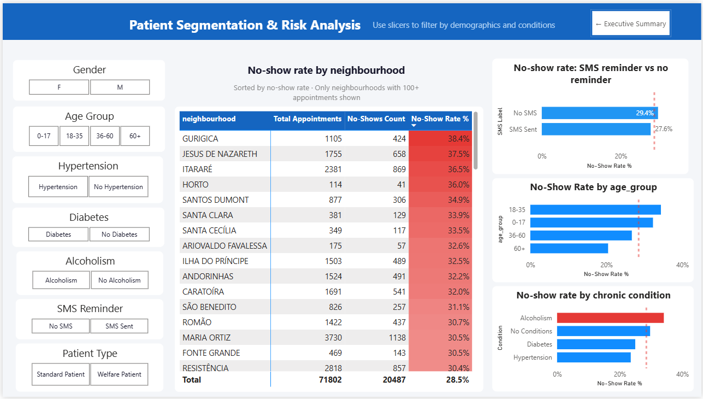
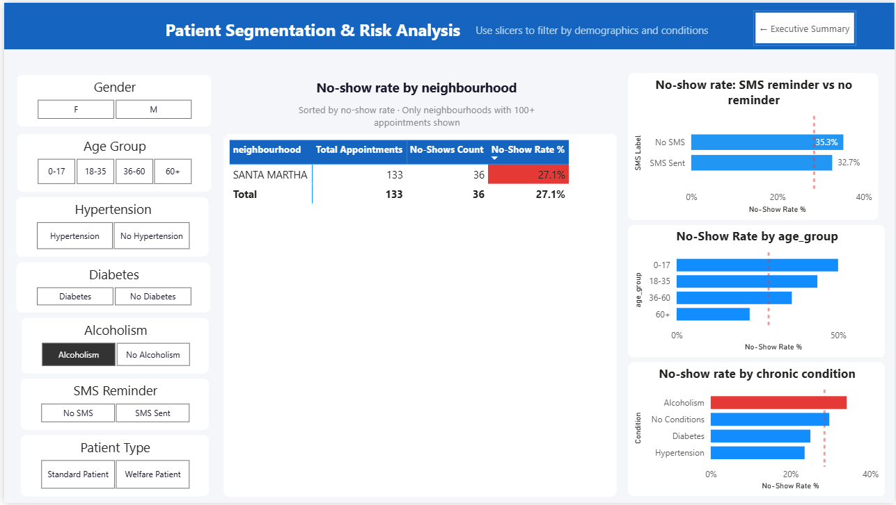

# Healthcare Patient No-Show Analysis



## Problem Statement

Missed medical appointments cost healthcare clinics both revenue 
and operational capacity. When a patient fails to show up, that 
appointment slot is wasted — it cannot be reallocated in time and 
the clinic absorbs the full cost.

This project analyses 71,959 real patient appointment records from 
Vitória, Brazil (April–June 2016) to identify the key drivers of 
no-shows, segment patients by risk profile, and surface actionable 
recommendations that clinic managers can act on immediately.

**The core question: which patients are most likely to miss their 
appointment — and what can the clinic do about it before they do?**

---

## Dashboard Preview

### Page 1 — Executive Summary


### Page 2 — Patient Segmentation (unfiltered)


### Page 2 — Patient Segmentation (filtered: Alcoholism patients)


---

## Key Findings

### Finding 1 — Age group
Patients aged 18–35 have the highest no-show rate at **34.4%**, 
followed closely by 0–17 at **32.3%** — both significantly above 
the overall average of 28.5%. Patients aged 60+ are the most 
reliable group at just **20.5%**, nearly 8 percentage points below 
average. No-show risk consistently decreases with age.

### Finding 2 — Day of week
Monday has the highest no-show rate at **30.2%** while Wednesday 
is the lowest at **27.2%** — a 3-point spread across the week. 
The clinic could strategically schedule lower-risk patient groups 
on Mondays to reduce overall missed appointment volume.

### Finding 3 — Geography
GURIGICA has the highest no-show rate at **38.4%**, followed by 
JESUS DE NAZARETH at **37.5%** and ITARARÉ at **36.5%** — all 
nearly 1.8x the city average of 28.5%. Every neighbourhood in 
the top 15 exceeds 30%, suggesting a geographic concentration 
of disengagement rather than isolated outliers.

### Finding 4 — Booking lead time
Same-day appointments have a no-show rate of just **21.4%**. 
Patients who book 30+ days in advance have a rate of **33.0%** 
— 1.54x higher. The pattern is perfectly linear across all five 
booking windows without exception:

| Booking window | No-show rate |
|----------------|-------------|
| 0 — same day   | 21.4%       |
| 1–7 days       | 25.0%       |
| 8–15 days      | 31.2%       |
| 16–30 days     | 32.7%       |
| 30+ days       | 33.0%       |

Lead time is the most actionable predictor in this dataset because 
it is known at the exact moment of booking — the clinic can flag 
high-risk appointments the instant they are scheduled.

### Finding 5 — SMS reminders
SMS reminders are associated with a **1.87 percentage point 
reduction** in no-show rate (29.44% → 27.57%). However, this 
likely understates the true effect: SMS patients had an average 
booking lead time of **18.0 days** versus **11.4 days** for 
non-SMS patients, making them a higher-risk cohort before the 
reminder was even sent. The clinic should expand SMS coverage 
specifically to patients with 15+ day lead times.

### Finding 6 — Chronic conditions
Patients with hypertension (**23.5%**) and diabetes (**25.0%**) 
are significantly more reliable than the overall average. 
Alcoholism is the exception — those patients show a **34.1%** 
no-show rate, the only condition associated with elevated risk. 
Patients with no chronic conditions at all have a **29.7%** rate 
— above average — representing the largest at-risk volume group.

---

## Revenue Impact

> Assumption: R$150 average appointment value (conservative estimate  
> based on Brazil public healthcare consultation costs, 2016).  
> Exchange rate: R$3.50 = $1 USD (approximate 2016 rate).

| Metric | Value |
|--------|-------|
| Total appointments | 71,959 |
| Total no-shows | 20,522 |
| Overall no-show rate | 28.5% |
| Total revenue lost | R$3,078,300 (~$880,000 USD) |
| Monthly revenue lost | R$513,050 |
| Monthly appointments missed | ~3,420 |
| High-risk segment loss (30+ day bookings) | R$480,750 |

**Recovery scenario:** A targeted reminder programme reducing 
no-shows by just 5 percentage points in the 30+ day booking 
segment would recover approximately **R$135,000 annually**.

---

## Business Recommendations

**1. Target SMS reminders by lead time, not randomly**  
Patients booking 15+ days in advance have a 31–33% no-show rate. 
Prioritise this group for automated reminders over same-week 
bookings which already have a 21–25% rate.

**2. Build a geographic outreach programme**  
GURIGICA, JESUS DE NAZARETH, and ITARARÉ collectively account 
for a disproportionate share of missed appointments. 
Neighbourhood-level health worker outreach in these areas would 
address the highest-concentration risk zones.

**3. Flag alcoholism patients as high risk at booking**  
With a 34.1% no-show rate — 5.6pp above average — alcoholism 
patients are the one chronic condition group requiring targeted 
intervention rather than standard scheduling.

**4. Protect Monday capacity**  
Monday has the highest no-show rate at 30.2%. Consider scheduling 
lower-risk patient segments (60+, chronic condition patients) 
on Mondays and reserving high-demand slots for patients with 
confirmed attendance patterns.

**5. Audit SMS targeting criteria**  
Current SMS sending appears correlated with lead time rather than 
risk profile. A randomised trial — sending reminders to 50% of 
patients regardless of lead time — would provide clean causal 
data on reminder effectiveness.

---

## Tools Used

| Tool | Purpose |
|------|---------|
| Python (Pandas, Matplotlib, Seaborn) | Data cleaning, EDA, visualisation |
| PostgreSQL | Data storage, aggregation queries |
| Power BI (DAX, Data Modelling) | Interactive dashboard |
| Git & GitHub | Version control |

---

## Project Structure

```
healthcare-noshow-analysis/
│
├── data/
│   ├── KaggleV2-May-2016.csv
│   └── cleaned_appointments.csv
│
├── notebooks/
│   ├── 01_data_cleaning.ipynb
│   └── EDA.ipynb
│
├── sql/
│   ├── 01_total_appointments.sql
│   ├── 02_noshow_by_neighbourhood.sql
│   ├── 03_noshow_by_age_group.sql
│   ├── 04_noshow_by_weekday.sql
│   ├── 05_sms_effectiveness.sql
│   └── 06_noshow_by_days_between.sql
│
├── dashboard/
│   ├── chart_chronic_conditions.png
│   ├── chart_condition_count.png
│   ├── chart_days_between.png
│   ├── chart_noshow_by_age.png
│   ├── chart_noshow_by_neighbourhood.png
│   ├── chart_noshow_by_weekday.png
│   ├── chart_revenue_loss.png
│   ├── chart_sms_effectiveness.png
│   ├── page1_executive_summary.png
│   ├── page2_patient_segmentation.png
│   ├── page2_filtered_alcoholism.png
│   └── dashboard.pbix
│
└── README.md
```

---

## Dataset

**Source:** Kaggle — Medical Appointment No Shows (JoniHoppen)  
**Records:** 110,527 raw → 71,959 after cleaning  
**Geography:** Vitória, Espírito Santo, Brazil  
**Period:** April – June 2016  
**Link:** https://www.kaggle.com/datasets/joniarroba/noshowappointments

---

## How to Run

**Python notebook:**
```bash
git clone https://github.com/YOUR_USERNAME/healthcare-noshow-analysis
cd healthcare-noshow-analysis
pip install pandas numpy matplotlib seaborn
jupyter notebook notebooks/intro.ipynb
```

**SQL queries:**  
Import `data/cleaned_appointments.csv` into PostgreSQL as table 
`appointments`, then run queries from the `sql/` folder in 
numbered order.

**Power BI dashboard:**  
Open `dashboard/dashboard.pbix` in Power BI Desktop. 
Refresh data source to point to your local 
`data/cleaned_appointments.csv` path.

---

## Author

**Siddharth Goswami**  
Aspiring Data Analyst  
[LinkedIn](https://www.linkedin.com/in/siddharth-goswami-/) · 
[GitHub](https://github.com/siddharth-0903) · 
siddharth43e@gmail.com